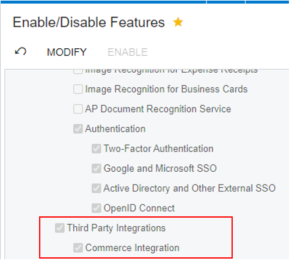

# Acumatica Custom Commerce Connector Blueprint

_Customization package that enable users to connect any external commerce system with Acumatica_

This customization package is an empty template that enables users to build a custom project to configure and connect any external commerce application that expose an API with Acumatica and integrate transactions between those two platforms. Package contains files to guide development of screens to manage and synchronize stock items, sales categories, product availability, non-stock Items, template Items and shipments direct from Acumatica and customers, sales orders, refunds and payment details direct from the external source.

## Prerequisites | Supported Versions

Acumatica 2022 R1 update 3

Enable Commerce Integration in Enable/Disable Features (CS100000) Screen.

## Prepare Development Environment

To start using this blueprint you should have an Acumatica instance ready.
Then follow these steps:

1. Clone this repository into your instance's ./App_Data/Projects folder.
2. Install the customization project zip file from the Customization Projects screen (SM204505) and publish it.
3. In that same screen, open the project and use the Extension Library -> Bind to Existing command to link the project to the code by pointing to the folder where you cloned the repository.
4. Open the C# solution file in Visual Studio and compile the project. Your instance should detect the newly compiled dll and you should see it in the instance's /Bin folder.

# Getting Started

This is an empty connector, which means you can compile and install it in an Acumatica instance but it will not do anything unless you add the necessary code.
The fastest way to get started is to follow [the Acumatica guide to implement a Connector](<https://help-2022r1.acumatica.com/(W(22))/Help?ScreenId=ShowWiki&pageid=87fda905-6a19-4f51-b16c-142ad8ce6948>).

The connector has the following parts:

- Classes for Acumatica ERP entities, which are adapters for the entities of the contract-based REST API of Acumatica ERP. For more information about these classes, see Classes for Acumatica ERP Entities.
- Classes for external entities, which are adapters for the entities of the REST API of the external e-commerce system. For details about these classes, see Classes for External Entities.
- Mapping classes, which define the mappings between internal and external entities. Mapping classes are described in Mapping Classes.
- Bucket classes, which define buckets of entities whose synchronization depends on one another. For more information, see Bucket Classes.
- Processor classes, which implement the synchronization of the entities between the external system and Acumatica ERP. Processor classes are described in greater detail in Processor Classes.
- A connector class, which connects other classes of the plug-in to the commerce forms of Acumatica ERP and defines the settings for these forms. For details about the implementation of the connector class, see Connector Class.
- A connector factory class, which initializes the connector. For details about the connector factory class, see Connector Factory Class.
- A configuration form, where the basic settings of the connector are specified. For example, the configuration form for the template is Cusotm Store (BC201020).

You will need to get the documentation for the REST API of your external system and define how the entities should map to Acumatica entities.

Then follow these steps to add the required code:

1. Create an Extension Library for Acumatica ERP
   This repository has everything you need to compile your library.
2. Create Classes for Acumatica ERP Entities
   You need to create classes for the Acumatica ERP entities to be synchronized with the external system through the connector. For details about the classes, see [Classes for Acumatica ERP Entities](<https://help-2022r1.acumatica.com/(W(22))/Help?ScreenId=ShowWiki&pageid=e42854cc-af54-4ac1-8560-5a8c7968451b>).
3. Creating Classes for External Entities
   Then you need to create classes for the external entities that you need to synchronize with the Acumatica ERP system through the connector. For details about the classes, see [Classes for External Entities](<https://help-2022r1.acumatica.com/(W(22))/Help?ScreenId=ShowWiki&pageid=87fda905-6a19-4f51-b16c-142ad8ce6948>).
4. Defining the Mappings Between Internal and External Entities
   For each pair of an internal entity and an external entity that should be synchronized, you must create a mapping class. For details about the mapping class, see [Mapping Classes](<https://help-2022r1.acumatica.com/(W(22))/Help?ScreenId=ShowWiki&pageid=b8f3a608-10cd-44cb-8338-96be1a45d02c>).
5. Creating the Buckets for the Mapped Entities
   For each mapping class, you need to create a bucket class. For details about bucket classes, see [Bucket Classes](<https://help-2022r1.acumatica.com/(W(22))/Help?ScreenId=ShowWiki&pageid=51df84f5-e853-415e-95d4-9aefaaff090f>).
6. Creating a DAC with the Configuration Settings
   After that you will create a DAC with the configuration settings that will be used by the connector. Normally this includes, values that need to be configurable for the external system API, like credentials and other values. For this DAC, you need to add the database table and include it in the customization project.
7. Implementing a REST Client of the External System
   Once you have the mapping classes ready, you should implement the REST API client to the external system.
8. Implementing the Processor Classes
   For each pair of entities that you need to synchronize, you need to create a processor class. A processor classes perform the following functions: retrieves the Acumatica ERP records and external records, provides the default mapping logic and the export and import logic. For details about processor classes, see [Processor Classes](<https://help-2022r1.acumatica.com/(W(22))/Help?ScreenId=ShowWiki&pageid=9b3624d8-b77f-427b-b56c-8008b3520201>).
9. Implementing the Processor Factory Class
   For the system to create processor classes for all entities used by the specified connector, you need to define the processor factory class. For details about the processor factory class, see [Processor Factory Class](<https://help-2022r1.acumatica.com/(W(22))/Help?ScreenId=ShowWiki&pageid=eb022898-6f8b-4721-9066-cd41f02387ac>).
10. Implementing the Connector Class
    The connector class is the main class of a connector for an e-commerce system.
    The connector class performs the following functions: - Provides the settings for connection with the external system - Implements navigation to external records - Performs the synchronization of records of the external system and Acumatica ERP - Implements real-time subscription and processing
    In the connector class which is included in this blueprint, you will now implement the synchronization of the Acumatica ERP entities and the external entities. For a detailed description of the connector class, see [Connector Class](<https://help-2022r1.acumatica.com/(W(22))/Help?ScreenId=ShowWiki&pageid=264c59ca-c18e-4e40-95ce-3c295f3456fc>).
11. Implementing the Connector Descriptor Class (optional)
    You need to create a connector descriptor class, which is required for the retrieval of external fields and for the implementation of work with push notifications. For details about the connector descriptor class, see [Connector Descriptor Class](<https://help-2022r1.acumatica.com/(W(22))/Help?ScreenId=ShowWiki&pageid=ea256e10-9acc-4a54-bd8c-2f66feffe31b>).
12. Implementing the Connector Factory Class
    For the system to create the connector class, you need to implement the connector factory class. For details about the connector factory class, see [Connector Factory Class](<https://help-2022r1.acumatica.com/(W(22))/Help?ScreenId=ShowWiki&pageid=1b1aa251-72f7-4eb2-bda9-084dad58dd1f>).
13. Creating the Configuration Form
    For a user to specify the basic settings of the connection with the external system, you need to create a custom form in Acumatica ERP. You can use the configuration form in this repository as a template and adjust the form.
14. Testing the Connector
    Now that you have completed the development of the connector, you can now test the connector. To test, you need to compile the library and sute the configuration form to enter the setting to your system.
